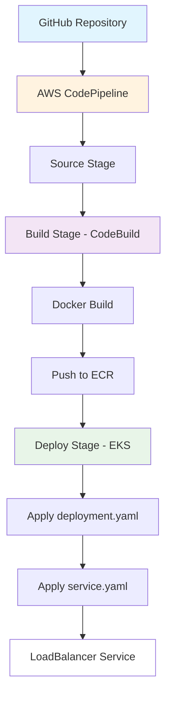

# Mind-Track-App

A web application for tracking and managing brain tasks, designed to help users organize their mental workload and productivity.

## Description

Mind-Track-App is a static single-page web application built with modern web technologies. It provides an intuitive interface for creating, tracking, and managing various cognitive tasks and mental activities.

This repository contains the DevOps implementation of the application. The original application was provided as a pre-built distribution containing only HTML, CSS, and JavaScript files, which have been containerized for deployment.

## CI/CD Pipeline

The application deployment is automated using AWS CodePipeline with the following workflow:

**Source (GitHub)** → **CodeBuild (Source Git + Docker image build + Docker image push to ECR)** → **Deploy: EKS (App by deployment.yaml, service.yaml for LoadBalancer)**

### Pipeline Stages

1. **Source Stage**: 
   - Connects to GitHub repository with authentication
   - Triggers pipeline on code changes

2. **Build Stage**:
   - Uses AWS CodeBuild
   - Clones source code from Git
   - Builds Docker image
   - Pushes Docker image to Amazon ECR

3. **Deploy Stage**:
   - Deploys to Amazon EKS cluster
   - Uses Kubernetes manifests (deployment.yaml and service.yaml)
   - Configures LoadBalancer service for external access

### AWS Stacks Used

- **Docker**: Application containerization
- **Amazon EKS**: Kubernetes orchestration for application deployment
- **Amazon ECR**: Docker image registry
- **AWS CodeBuild**: Build service for Docker image creation and ECR push
- **AWS CodePipeline**: CI/CD orchestration pipeline
- **Amazon CloudWatch**: Log management and monitoring

### Pipeline Diagram



## Features

- Task creation and management
- Intuitive user interface
- Responsive design for mobile and desktop
- Fast loading static application
- Containerized deployment
- Automated CI/CD pipeline

## Prerequisites

- Docker (for containerization)
- Kubernetes cluster (for deployment, optional)
- AWS CLI (for ECR and EKS operations)

## Running Locally

### Using Docker

1. Build the Docker image:
   ```bash
   docker build -t mind-track-app .
   ```

2. Run the container:
   ```bash
   docker run -p 8080:80 mind-track-app
   ```

3. Open your browser and navigate to `http://localhost:8080`

### Using a Local Server

You can also serve the `app/` directory with any static file server:

```bash
cd app
python3 -m http.server 8080
```

## Deployment

### Docker Image

The application is containerized using Nginx to serve the static files. The Dockerfile copies the built application from the `app/` directory.

### Kubernetes Deployment

The `k8s/` directory contains Kubernetes manifests for deploying the application:

- `deployment.yaml`: Defines the deployment with 2 replicas
- `service.yaml`: Exposes the application via a LoadBalancer on port 80

To deploy:

1. Ensure you have `kubectl` configured for your cluster.

2. Apply the manifests:
   ```bash
   kubectl apply -f k8s/
   ```

3. Get the external IP:
   ```bash
   kubectl get services
   ```

The current deployment uses a pre-built image from AWS ECR: `713545429153.dkr.ecr.ap-south-2.amazonaws.com/prod/mtapp`

To build and push your own image:

1. Build the image locally or via CodeBuild
2. Tag and push to ECR
3. Update the `image` field in `deployment.yaml` if needed

## Technologies Used

- **Frontend**: HTML5, CSS3, JavaScript (ES6+)
- **Build Tool**: Vite (inferred from asset naming)
- **Containerization**: Docker with Nginx Alpine
- **Orchestration**: Kubernetes / Amazon EKS
- **CI/CD**: AWS CodePipeline, CodeBuild
- **Container Registry**: AWS ECR

## Project Structure

```
Mind-Track-App/
├── Dockerfile              # Docker configuration
├── app/                    # Pre-built application distribution (HTML, CSS, JS)
│   ├── index.html         # Main HTML file
│   └── assets/            # Compiled CSS and JS
├── k8s/                   # Kubernetes manifests
│   ├── deployment.yaml    # Deployment configuration
│   └── service.yaml       # Service configuration
└── README.md              # This file
```

## Credits

This application was originally created by [Vennilavanguvi](https://github.com/Vennilavanguvi/Trend). The DevOps implementation, including Docker containerization, AWS ECR hosting, and Kubernetes deployment, was contributed by me.

## Contributing

1. Fork the repository
2. Create a feature branch
3. Make your changes
4. Test locally
5. Submit a pull request
4. Test locally
5. Submit a pull request
